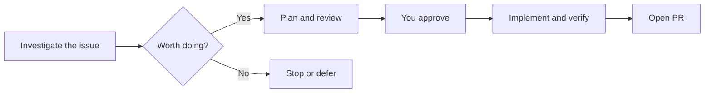
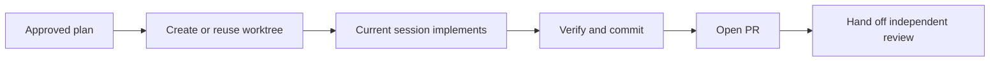
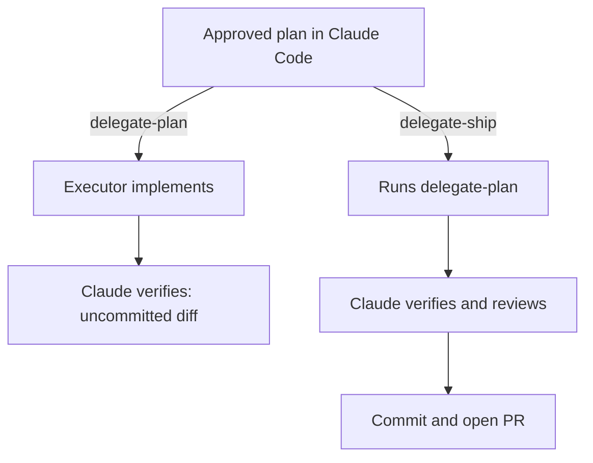

# Personal agent skills

Reusable workflows for investigating tasks, planning changes, shipping code, and creating reports or visuals. Each folder under `skills/` is one installable skill. Choose the ones you need; you do not have to run a full pipeline for every change.

## What do you want to do?

| I want to… | Start here |
|---|---|
| Check whether an issue needs work | [tackle-task](skills/tackle-task/SKILL.md) |
| Check a plan or a reviewer's findings | [final-plan-check](skills/final-plan-check/SKILL.md) or [review-findings](skills/review-findings/SKILL.md) |
| Implement an approved plan and open a PR | [worktree-ship](skills/worktree-ship/SKILL.md), or [delegate-ship](skills/delegate-ship/SKILL.md) from Claude Code |
| Have another executor implement, then inspect the diff | [delegate-plan](skills/delegate-plan/SKILL.md), from Claude Code |
| Commit or publish changes I already have | [commit](skills/commit/SKILL.md), [commit-push](skills/commit-push/SKILL.md), or [open-pr](skills/open-pr/SKILL.md) |
| Explain a plan or completed work | [plan-to-artifact](skills/plan-to-artifact/SKILL.md) or [task-report](skills/task-report/SKILL.md) |
| Create a chart, diagram, poster, or generative artwork | [Visual skills](#visual-skills) |

For a substantial change, the usual flow is:



An open PR still needs review and merging. The publishing skills here do not merge it.

## Which agent runs the skill?

The **host** is the agent where you invoke the skill. In `/delegate-plan codex`, Claude Code is the host and Codex is the executor doing the implementation.

| Skills | Host behavior |
|---|---|
| `plan-pipeline`, `delegate-plan`, `delegate-plan-review`, `delegate-ship` | **Claude Code only.** Delegation can target Codex, Grok CLI, Copilot CLI, or a Claude subagent. |
| `worktree-ship`, `plan-to-artifact`, `task-report`, `probe`, `wrap` | Separate workflows for Claude Code and for Codex/Grok CLI/Copilot CLI. The skill selects the host's instructions. |
| `open-pr` | Adds Claude-specific review follow-up commands when hosted by Claude Code. |
| `simplify` | This catalog supplies a cleanup workflow. The existing Claude selection uses Claude Code's bundled `/simplify` instead. |

Other skills share instructions, but support still depends on the tools available in the host. Installing a skill does not establish compatibility, and the installer does not enforce the Claude-only restrictions. `probe` always investigates **Claude Code behavior**, even when another agent drives the test.

Examples below name their host. Use `$skill-name` in Codex or Grok CLI, and `/skill-name` in Claude Code or Copilot CLI. These are prompts to the agent, not shell commands.

## Install

Requires Node.js/npm and your chosen agent. From this checkout, list the catalog and install a small set for committing and publishing existing work:

```bash
npx skills add . --list

# Codex
npx skills add . --skill commit commit-push open-pr simplify --agent codex --global

# Claude Code, using its bundled /simplify
npx skills add . --skill commit commit-push open-pr --agent claude-code --global
```

Choose the command for your host, then start a fresh agent session. `--global` makes the skills available across projects. To install into one project, run from that project, replace `.` with this checkout's absolute path or Git URL, and omit `--global`. A published repository can also be addressed as `OWNER/REPO`; private repositories use existing Git authentication. See the [skills CLI documentation](https://github.com/vercel-labs/skills#readme).

Install the other skills your chosen workflow calls, too. For example, `worktree-ship` uses `commit-open-pr`, which calls `commit` and `open-pr`. Some workflows also require skills from outside this catalog: `grilling` for `plan-pipeline`, `delta-diagrams` for behavioral diagrams, and `code-review` for `delegate-ship`. Claude's PR handoff suggests `babysit-prs`. These dependencies are not bundled automatically; follow the linked skill's requirements for tools such as GitHub CLI, authenticated executor CLIs, `jq`, Python, and tmux.

## Practical examples

### Investigate and implement a bug

Suppose issue #123 reports that uploads time out. Investigate before assuming its proposed fix is right.

**In Codex:**

```text
$tackle-task https://github.com/OWNER/REPO/issues/123
```

Read the verdict. If the work is worth doing, ask the agent to draft a plan with the intended behavior, scope, and checks. Use `$final-plan-check` to critique it, resolve the findings, then approve the plan. Use `$plan-implementation` when a fresh session or executor needs a self-contained handoff; skip it when the existing plan and context suffice.

With the approved plan available:

```text
$worktree-ship
```



`worktree-ship` performs implementation and checks in an isolated Git worktree. Codex, Grok CLI, and Copilot CLI use explicit worktree paths; Claude Code uses its native `EnterWorktree` tool. By default, the skill ends at the PR and review handoff.

### Plan and delegate from Claude Code

**Claude Code only.** After `/tackle-task` and a decision to proceed, enter plan mode and run:

```text
/plan-pipeline
```

It clarifies the approach, checks the code references, prepares a handoff when needed, offers an external review, and runs `final-plan-check` before requesting approval. It calls the component skills itself. If you choose external review, it uses `delegate-plan-review --verify` to check findings against the code.

After approval, choose one execution path. Use the actual saved plan path; the path below is an example.

| What you want | Command in Claude Code | Result |
|---|---|---|
| Codex implements; you inspect before publishing | `/delegate-plan codex ~/.claude/plans/123-fix-timeout.md` | Verified, uncommitted changes in a worktree |
| Codex implements; Claude verifies, reviews, and publishes | `/delegate-ship codex ~/.claude/plans/123-fix-timeout.md` | An open PR and review follow-up commands |
| This session implements and publishes | `/worktree-ship ~/.claude/plans/123-fix-timeout.md` | An open PR handed off for independent review |



The executor can also be `grok`, `copilot`, or `claude`. Optional `--model` and `--effort` flags override configured defaults; the Claude subagent supports model selection but has no effort control. `delegate-plan` also supports `--resume` for continuing a run, subject to that executor's resume limits.

You can request a second opinion on a draft without running the whole pipeline:

```text
/delegate-plan-review codex --verify ~/.claude/plans/123-fix-timeout.md
```

With `--verify`, confirmed corrections are applied when the input is the live plan. Without it, use `review-findings` to check the review before acting. Approval is needed for implementation, not for requesting a plan review.

### Finish a small fix or publish existing work

Suppose you have already fixed a typo or a small bug and run the relevant checks. Choose the endpoint you need; these are alternatives, not a sequence.

| Endpoint | Codex | Claude Code |
|---|---|---|
| Local commit | `$commit` | `/commit` |
| Commit and push the current branch | `$commit-push` | `/commit-push` |
| Commit and open a PR | `$commit-open-pr` | `/commit-open-pr` |
| Open a PR for existing work | `$open-pr` | `/open-pr` |

`commit` normally runs a cleanup pass and stages only the intended changes. `open-pr` can also call `commit` when changes are uncommitted; when the commits already exist, it publishes those. You do not need to create a plan or invoke an implementation workflow just to publish finished work.

### Explain work or create a visual

Give the skill the material and the output you want. For example, in Codex:

```text
$plan-to-artifact Turn the current plan into a local review page.
$task-report Create a local debrief of this fix with its changes and test evidence.
$artifact-design Make a self-contained HTML report from these benchmark results.
$canvas-design Create a PNG poster for a community coding night.
$algorithmic-art Create a flow-field artwork with seed and density controls.
```

`plan-to-artifact` presents a plan awaiting approval; `task-report` explains completed work. Neither performs a code review. Both offer local HTML output; publishing depends on the host's tools. For an HTML report, `artifact-diagramming` explains mechanisms and `dataviz` handles charts. See the [visual skills](#visual-skills) for the output of each.

## Skill reference

Each link opens the actual workflow, including its prerequisites. **Claude only** means Claude Code must host it. **Host-specific** means it selects separate instructions for Claude Code and the other listed agents. Unmarked skills share instructions, subject to available tools.

### Planning and review

| Skill | Use it when you have… | Result and stopping point |
|---|---|---|
| [tackle-task](skills/tackle-task/SKILL.md) | An issue or proposal to investigate | Evidence, a verdict, and a recommendation; no edits or issue updates |
| [plan-pipeline](skills/plan-pipeline/SKILL.md) · **Claude only** | A triaged task in plan mode | A grounded, reviewed plan presented for approval; no implementation |
| [plan-implementation](skills/plan-implementation/SKILL.md) | Settled decisions that need a handoff | A self-contained plan with scope, contracts, and verification |
| [final-plan-check](skills/final-plan-check/SKILL.md) | A draft plan to challenge | Evidence-backed critique; no implementation or automatic plan rewrite |
| [delegate-plan-review](skills/delegate-plan-review/SKILL.md) · **Claude only** | A plan needing an independent second opinion | A review; `--verify` checks findings and applies supported corrections to a live plan |
| [review-findings](skills/review-findings/SKILL.md) | Findings from a person, bot, or another agent | Confirmed, refuted, partial, or unresolved findings; fixes only when requested |
| [plan-to-artifact](skills/plan-to-artifact/SKILL.md) · **Host-specific** | A plan and any existing review history | A review page; does not critique or approve the plan |

### Implementation and publishing

| Skill | Use it when you have… | Result and stopping point |
|---|---|---|
| [delegate-plan](skills/delegate-plan/SKILL.md) · **Claude only** | An approved plan for another executor | A verified worktree diff; no staging, commit, push, or PR |
| [delegate-ship](skills/delegate-ship/SKILL.md) · **Claude only** | An approved plan to delegate through publication | Delegation, independent verification, code review, commit, and an open PR; follow-up review commands |
| [worktree-ship](skills/worktree-ship/SKILL.md) · **Host-specific** | An approved plan for the current session | Implementation in a worktree, checks, and an open PR; independent review handoff by default |
| [simplify](skills/simplify/SKILL.md) | A recent or staged diff to clean up | Behavior-preserving edits and a report; no feature redesign |
| [commit](skills/commit/SKILL.md) | Changes ready for a local commit | Cleanup, precise staging, and a commit; no push |
| [commit-push](skills/commit-push/SKILL.md) | Changes to commit and push | A commit pushed to the current branch's destination; no PR |
| [commit-open-pr](skills/commit-open-pr/SKILL.md) | Changes to commit and publish as a PR | Branch preparation, commit, push, and an open PR |
| [open-pr](skills/open-pr/SKILL.md) | Existing work to publish | Branch preparation, a commit if needed, push, and an open PR; no merge or review |

### Investigation and reporting

| Skill | Use it when you have… | Result and stopping point |
|---|---|---|
| [probe](skills/probe/SKILL.md) · **Host-specific** | A question about Claude Code's behavior | Matching saved evidence or an isolated interactive test and verdict; supports consult-only lookup |
| [task-report](skills/task-report/SKILL.md) · **Host-specific** | Completed work to explain | A debrief with changes, decisions, and verification evidence; not a code review |
| [wrap](skills/wrap/SKILL.md) · **Host-specific** | A session to close | Saved learnings, required project close steps, and loose ends; no commit, push, or PR |

### Visual skills

| Skill | Use it when you need… | Output |
|---|---|---|
| [artifact-design](skills/artifact-design/SKILL.md) | A report, dashboard, or explainer page | Self-contained HTML with a deliberate layout and visual style |
| [artifact-diagramming](skills/artifact-diagramming/SKILL.md) | To explain how components, data, or states connect | Mechanism diagrams within an HTML page |
| [dataviz](skills/dataviz/SKILL.md) | To compare values, trends, or categories | Accessible charts with validated colors and appropriate labels |
| [canvas-design](skills/canvas-design/SKILL.md) | A static poster or artwork | A design philosophy plus PNG or PDF artwork |
| [algorithmic-art](skills/algorithmic-art/SKILL.md) | Generative artwork with adjustable parameters | A philosophy, p5.js algorithm, and interactive HTML viewer |

## Updates and maintenance

For Git-sourced installations, update selected skills with:

```bash
npx skills update commit commit-push open-pr --global
```

For local-path installations, pull changes into the checkout and rerun the install command. Keep edits in this source repository; updates can replace changes made to installed copies. The default installation links agents to a canonical installed copy. `--copy` creates independent agent copies. Neither mode links back to this source checkout. See the [CLI update documentation](https://github.com/vercel-labs/skills#skills-update).

<details>
<summary>Saved 17-skill Claude Code selection</summary>

To reproduce the 17-skill selection used by this catalog:

```bash
npx skills add . --agent claude-code --global --skill \
  tackle-task delegate-plan delegate-plan-review delegate-ship \
  plan-pipeline plan-to-artifact probe task-report worktree-ship wrap \
  plan-implementation commit-open-pr commit commit-push open-pr \
  final-plan-check review-findings
```

This selection uses Claude Code's bundled `/simplify` and excludes the five visual skills. It is a saved selection, not a dependency-complete installation for every workflow. Choose skills explicitly rather than using `--all` to preserve it.

</details>

<details>
<summary>Package structure and local authoring</summary>

Each `skills/<name>/SKILL.md` is the entrypoint. Supporting scripts, references, and assets stay in that package. The five skills with separate host workflows use this layout:

```text
skills/task-report/
  SKILL.md
  references/agents.md
  references/claude.md
  scripts/
```

Choose the workflow by host, regardless of the model or delegated executor. Preserve existing workflow prose when maintaining packages; keep packaging fixes separate from behavior changes. Resource paths in workflows are relative to the package root, while Markdown links are relative to their containing document. Resolve `<name-skill-dir>` to the installed skill's absolute path before executing a command.

For local authoring, user-scope skill folders can be symlinked directly to `skills/<name>` in this checkout. Those links share source edits and are maintained through Git, independently of CLI-managed installations. Do not install over an authoring link. Installing this catalog does not automatically migrate existing user-scope folders.

</details>

Bundled license files and font notices remain with their assets. No repository-wide license is assigned by this import.
